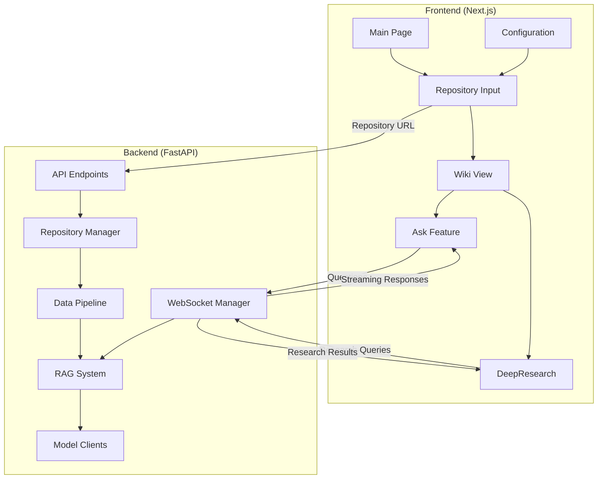
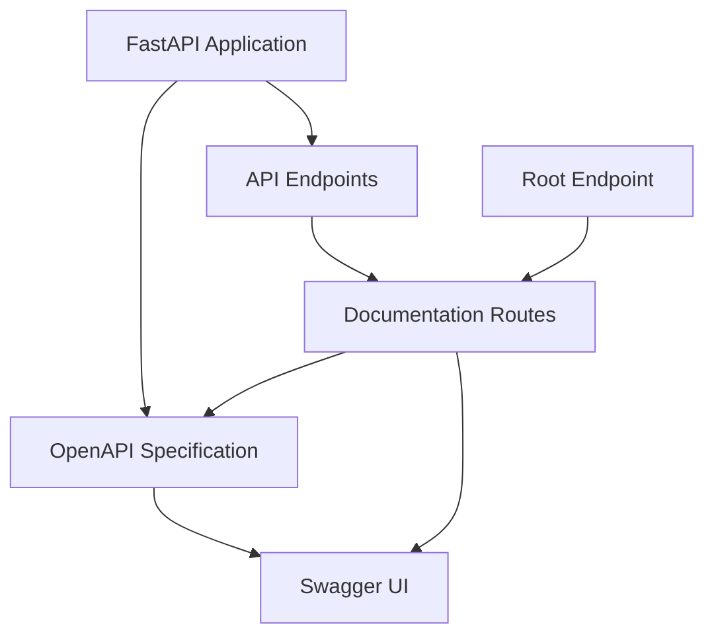
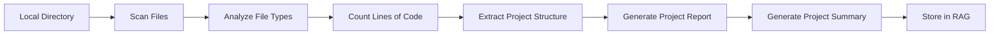
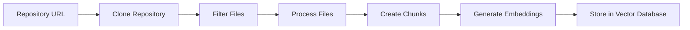
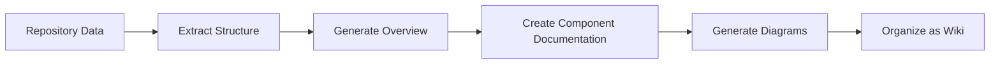
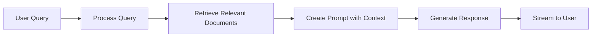
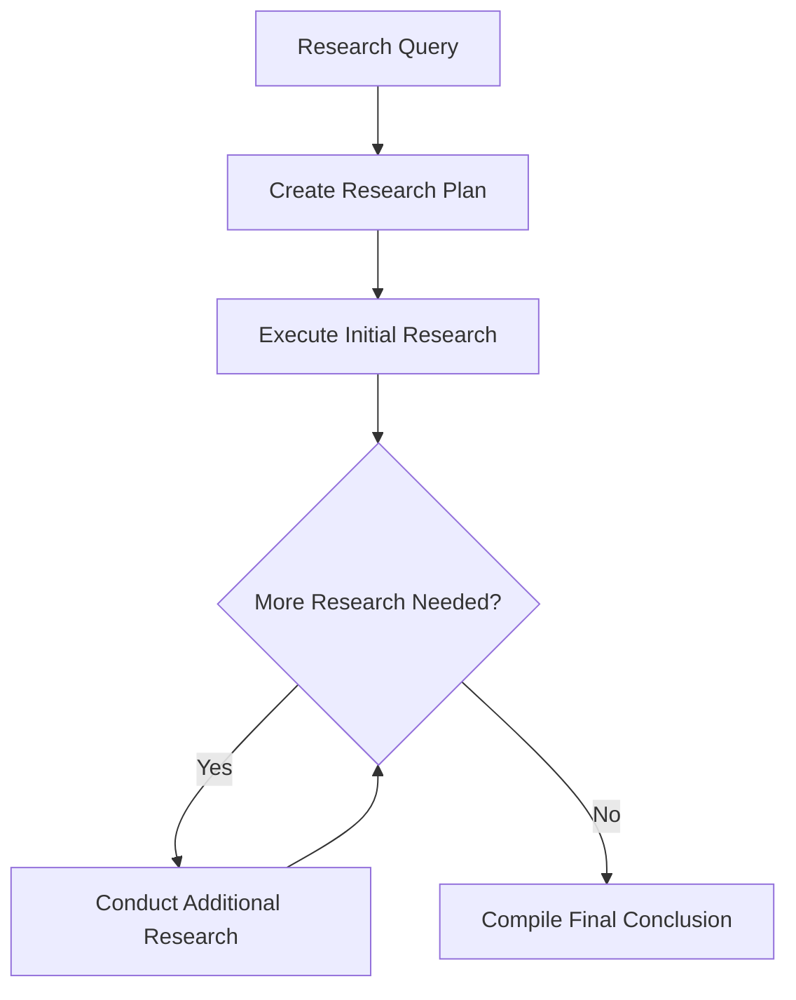

# System Patterns: DeepWiki-Open

## System Architecture

DeepWiki-Open follows a modern client-server architecture with clear separation of concerns:

### Key Components

#### Local Project Analysis
- **Local Report API**: Analyzes local project directories and generates reports
- **Project Analyzer**: Extracts statistics and insights from local projects
- **Report Generator**: Creates comprehensive reports with project summaries
- **RAG Integration**: Stores reports in the RAG system for later querying
- **CLI Interface**: Command-line interface for easy usage

#### Frontend
- **Main Page**: Entry point for the application
- **Repository Input**: Interface for entering repository URLs and configuration
- **Wiki View**: Displays generated documentation and diagrams
- **Ask Feature**: Interface for querying the repository
- **DeepResearch**: Interface for conducting multi-turn research
- **Configuration**: Settings for model selection and other options

#### Backend
- **API Endpoints**: FastAPI routes for handling requests
- **API Documentation**: OpenAPI specification and Swagger UI
- **Repository Manager**: Handles cloning and managing repositories
- **Data Pipeline**: Processes repository files into embeddings
- **RAG System**: Retrieval Augmented Generation for context-aware responses
- **Model Clients**: Interfaces with various AI model providers
- **WebSocket Manager**: Handles streaming responses for real-time interaction
- **Local Project Analyzer**: Analyzes local project directories and generates reports

## Design Patterns

### Repository Pattern
Used for abstracting data access and manipulation operations for repositories:
- **DatabaseManager**: Manages repository data storage and retrieval
- **Repository**: Represents a code repository with metadata and content

### Factory Pattern
Implemented for creating model clients based on configuration:
- **ModelClientFactory**: Creates appropriate client instances for different providers
- **EmbeddingClientFactory**: Creates embedding model clients

### Strategy Pattern
Applied for different embedding and generation strategies:
- **EmbeddingStrategy**: Different approaches for creating embeddings
- **GenerationStrategy**: Different approaches for generating content

### Observer Pattern
Used for WebSocket communication:
- **WebSocketManager**: Manages connections and broadcasts messages
- **ConnectionManager**: Tracks active connections

### Adapter Pattern
Implemented for supporting different model providers:
- **OpenAIAdapter**: Adapts OpenAI API to common interface
- **GoogleAdapter**: Adapts Google Gemini API to common interface
- **OpenRouterAdapter**: Adapts OpenRouter API to common interface
- **OllamaAdapter**: Adapts Ollama API to common interface

### Facade Pattern
Applied to simplify complex subsystems:
- **SwaggerFacade**: Provides a simplified interface to the OpenAPI documentation system
- **APIDocumentation**: Encapsulates the complexity of API documentation generation

### Singleton Pattern
Applied for configuration and connection management:
- **ConfigManager**: Manages application configuration
- **ConnectionManager**: Manages WebSocket connections

## API Documentation System

### Key Components
- **OpenAPI Specification**: Comprehensive documentation of all API endpoints
- **Swagger UI**: Interactive interface for exploring and testing the API
- **Documentation Routes**: Endpoints for serving documentation files
- **Root Endpoint**: Entry point with links to documentation

### Documentation Organization
- **Tags**: Logical grouping of endpoints (Chat, Wiki, Local Project, Models, Health)
- **Schemas**: Detailed models for requests and responses
- **Parameters**: Documentation of query parameters, path parameters, and request bodies
- **Responses**: Documentation of response formats and status codes

## Component Relationships

### Frontend-Backend Communication
- REST API for repository processing and wiki generation
- WebSockets for streaming chat and research responses
- JSON for configuration and data exchange

### Data Flow
1. User inputs repository URL
2. Frontend sends request to backend
3. Backend clones repository
4. Backend processes files and creates embeddings
5. Backend generates wiki content using AI models
6. Frontend displays generated content
7. User can interact with content through Ask and DeepResearch features

### Model Provider Integration
- Configuration-driven model selection
- Provider-specific clients with common interfaces
- Environment variables for API keys and endpoints

## Critical Implementation Paths

### Local Project Analysis Pipeline

### Repository Processing Pipeline

### Wiki Generation Process

### RAG Implementation

### DeepResearch Process

## Key Technical Decisions

### Vector Database
- Using FAISS for efficient similarity search
- In-memory storage for performance
- Persistence to disk for data retention

### Text Processing
- Chunking strategies optimized for code understanding
- Overlap between chunks to maintain context
- Special handling for different file types

### Model Integration
- Provider-based model selection system
- Configuration-driven model parameters
- Fallback mechanisms for API failures

### Caching Strategy
- Repository caching to avoid repeated cloning
- Embedding caching for performance optimization
- Wiki content caching for quick access

### Security Considerations
- Secure handling of API keys through environment variables
- Token-based authentication for private repositories
- Isolation of repository data between users

## Performance Optimizations

### Parallel Processing
- Concurrent file processing for faster embedding generation
- Parallel diagram generation

### Streaming Responses
- WebSocket-based streaming for real-time interaction
- Progressive loading of wiki content

### Resource Management
- Efficient memory usage for large repositories
- Garbage collection for temporary files

### Caching
- Multi-level caching system
- LRU (Least Recently Used) cache eviction policy
